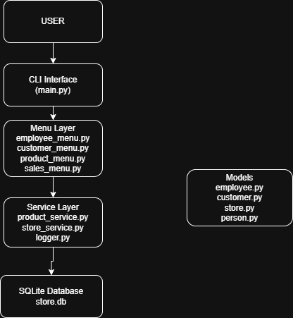
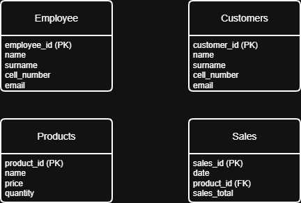
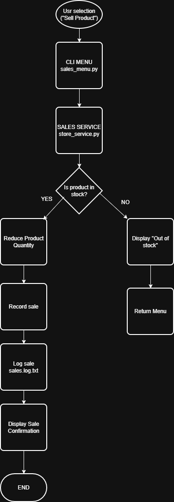

# Store Management System

A Python-based **Store Management System** built using **Object-Oriented Programming (OOP)** and **SQLite**.
The system manages employees, customers, products, and sales while maintaining inventory records and logging transactions.

This project was originally developed as a coursework assignment and later upgraded into a **portfolio project demonstrating backend architecture, layered design, and software engineering practices.**

---

# Features

### Employee Management

* Add employees
* Remove employees
* Display employee records

### Customer Management

* Add customers
* Remove customers
* Display customer records

### Product Inventory

* Add products
* Update product price and quantity
* Remove products or reduce inventory when items are damaged
* Display available products

### Sales Processing

* Sell products
* Automatically update inventory after each sale
* Record sales transactions

### Logging System

All important system actions such as sales transactions are logged to a file.

Example log entry:

```
2026-03-13 10:11:02 | SALE | Product: Laptop | Quantity: 2 | Total: 2400
```

Logs are stored in:

```
logs/system_log.txt
```

This helps track system activity and demonstrates **basic production logging practices**.

### Input Validation

The system validates user inputs to prevent invalid data from entering the system.

Examples include:

* Preventing negative prices
* Ensuring product quantities are positive
* Validating product and employee IDs
* Preventing invalid menu selections


---

# Technologies Used

* Python
* SQLite
* Object-Oriented Programming
* Git / GitHub
* CLI Application Design

---

# Project Architecture

The system follows a **layered architecture** separating user interaction, business logic, and data storage.

```
CLI Interface
     ↓
Menu Layer
     ↓
Service Layer
     ↓
Models
     ↓
SQLite Database
```

This architecture allows the system to be extended easily with additional interfaces such as APIs or GUIs.

---

# Project Structure

```
store-management-system
│
├── main.py
│
├── models
│   person.py
│   employee.py
│   customer.py
│   product.py
│
├── menus
│   employee_menu.py
│   customer_menu.py
│   product_menu.py
│   sales_menu.py
│
├── services
│   product_service.py
│   store_service.py
│   logger.py
│
├── database
│   db.py
│
├── logs
│   system_log.txt
│
├── docs
│   architecture diagrams
│
└── README.md
```

---

# Database Design

### Employees

| Field       | Description      |
| ----------- | ---------------- |
| employee_id | Primary key      |
| name        | Employee name    |
| surname     | Employee surname |
| cell_number | Contact number   |
| email       | Email address    |

### Customers

| Field           | Description              |
| --------------- | ------------------------ |
| customer_id     | Primary key              |
| name            | Customer name            |
| surname         | Customer surname         |
| cell_number     | Contact number           |
| email           | Email address            |
| billing_address | Customer billing address |

### Products

| Field      | Description        |
| ---------- | ------------------ |
| product_id | Primary key        |
| name       | Product name       |
| price      | Product price      |
| quantity   | Inventory quantity |

### Sales

| Field        | Description             |
| ------------ | ----------------------- |
| sales_id     | Primary key             |
| date         | Sale date               |
| product_name | Product sold            |
| sales_total  | Total value of the sale |

---

# How to Run the Project

1. Clone the repository

```
git clone https://github.com/YOUR_USERNAME/store-management-system.git
```

2. Navigate to the project folder

```
cd store-management-system
```

3. Run the application

```
python main.py
```

---

# Example Usage

```
===== Store Management System =====

1 Manage Employees
2 Manage Customers
3 Manage Products
4 Sales
0 Exit
```

---
# System Architecture



# Database Schema



# Program Flow


# Future Improvements

Planned upgrades include:

* REST API using Flask
* Desktop GUI using Tkinter
* Improved service layer architecture
* Configuration management
* Docker containerization
* Cloud deployment

---

# Author

Developed as part of a **Software Engineering coursework project** and expanded into a backend portfolio project demonstrating system design, logging, and layered architecture.
